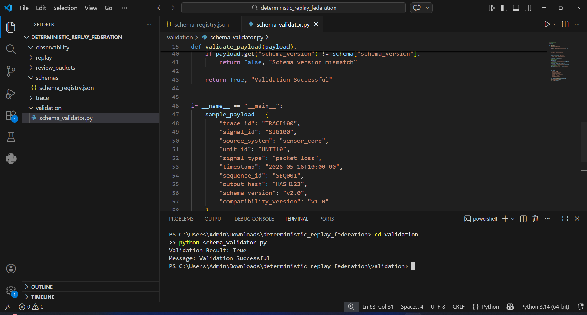
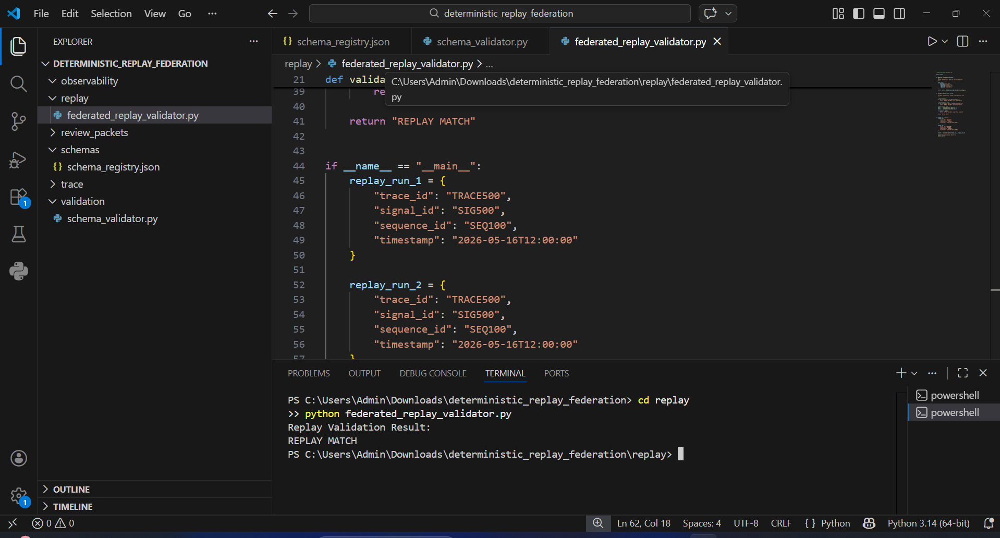
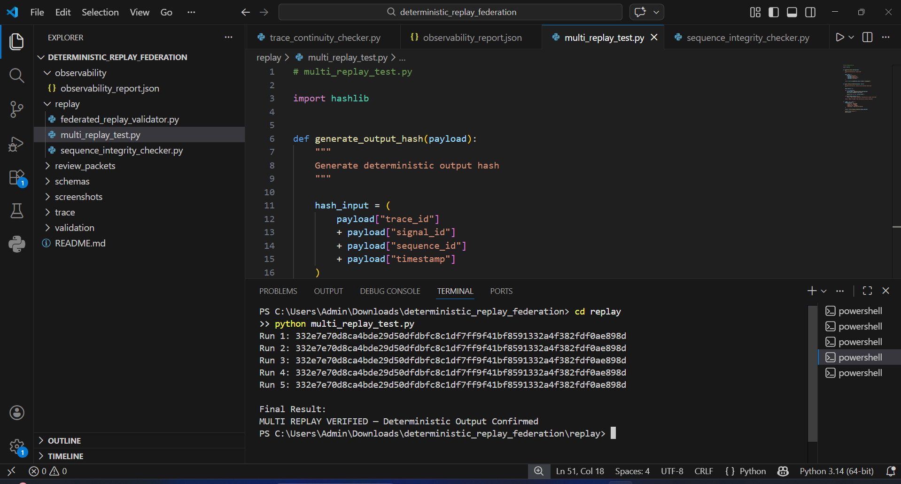
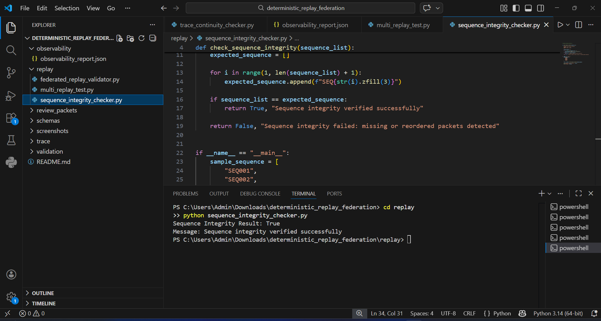
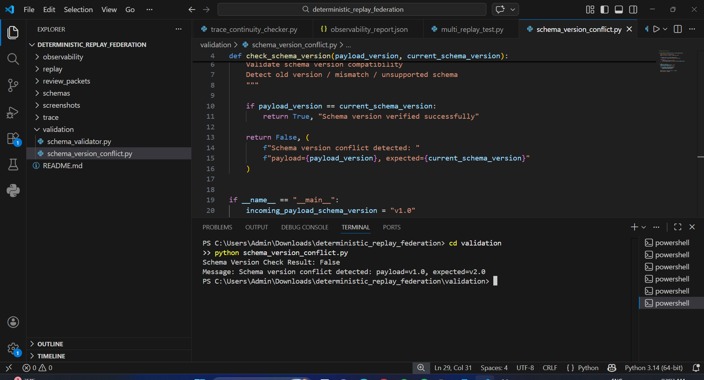
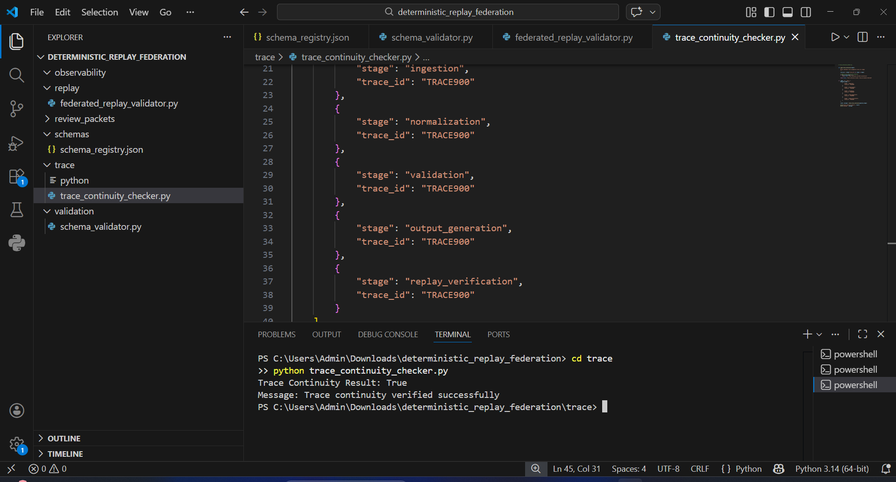
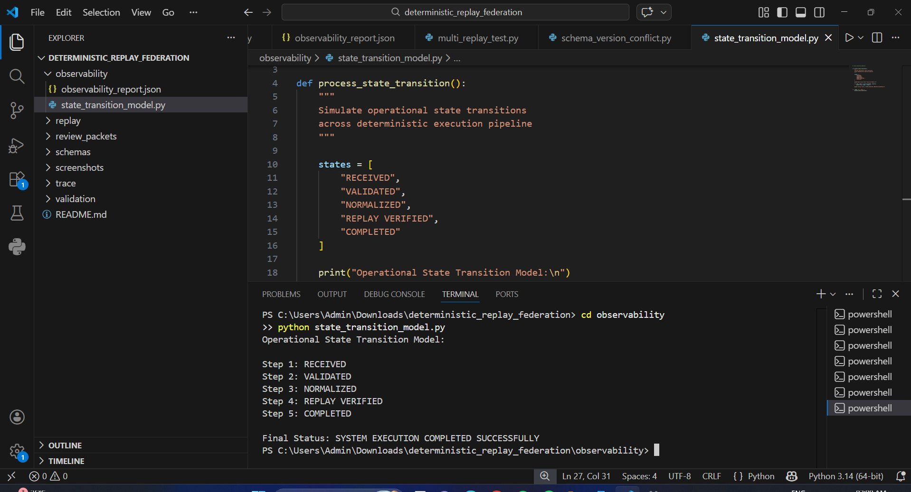
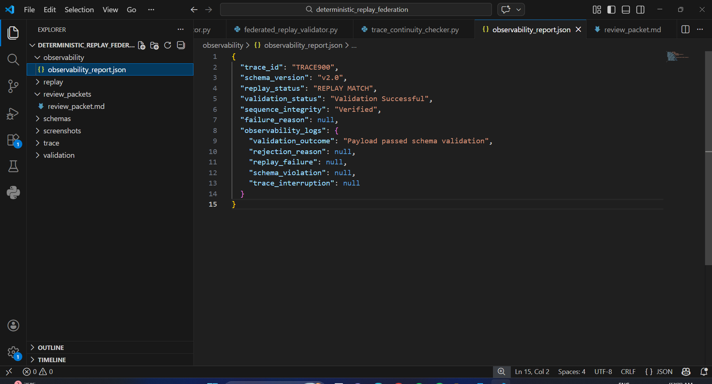

# REVIEW_PACKET.md

# Review Packet — Cross-System Determinism + Replay Validation + Schema Federation

---

## Project Summary

This project validates deterministic interoperability across multiple systems by ensuring schema federation, replay consistency, immutable trace continuity, sequence integrity, schema evolution safety, operational state visibility, and observability-safe execution.

The objective is to prevent:

* schema drift
* silent field mutations
* replay inconsistencies
* trace discontinuity
* broken packet ordering
* schema version conflicts
* non-deterministic execution failures

This is infrastructure integrity engineering, not dashboard/UI development.

---

# ENTRY POINT

## Main Project Execution Flow

Incoming Payload
↓
Schema Validation
↓
Schema Version Verification
↓
Replay Validation
↓
Multi Replay Determinism Check
↓
Sequence Integrity Verification
↓
Trace Continuity Verification
↓
Observability Report Generation
↓
Operational State Completion
↓
Final Deterministic Verification

---

# FEDERATED REPLAY FLOW

## Replay Verification Logic

Replay Run 1
↓
Trace ID Match
↓
Sequence Order Match
↓
Output Hash Match
↓
Replay Run 2
↓
REPLAY MATCH

If any mismatch occurs:

REPLAY FAILURE

System must fail visibly and deterministically.

---

# ADVANCED MULTI REPLAY VALIDATION

## Repeated Deterministic Replay Proof

The same payload is executed across 5 independent runs.

Verification proves:

same input
→ same output hash
→ every single time

This ensures deterministic replay is not accidental and remains stable across repeated execution.

Expected Output:

Run 1 → Same Hash
Run 2 → Same Hash
Run 3 → Same Hash
Run 4 → Same Hash
Run 5 → Same Hash

Final Result:

MULTI REPLAY VERIFIED — Deterministic Output Confirmed

---

# SEQUENCE INTEGRITY FLOW

## Ordered Packet Verification

Expected sequence:

SEQ001
→ SEQ002
→ SEQ003
→ SEQ004
→ SEQ005

System detects:

* missing packets
* reordered packets
* broken replay order

Failure Example:

SEQ001
→ SEQ003
→ SEQ002

This must fail deterministically.

---

# TRACE PROPAGATION FLOW

## Immutable Trace Verification

Ingestion
↓
Normalization
↓
Validation
↓
Output Generation
↓
Replay Verification

Same:

trace_id

must be preserved across all stages.

If trace_id changes:

System must fail visibly.

---

# SCHEMA VALIDATION FLOW

## Validation Checks

The system validates:

* incoming payloads
* outgoing payloads

The system rejects:

* unknown fields
* missing required fields
* silent field mutations
* schema version mismatch

This prevents unsafe schema federation.

---

# SCHEMA VERSION CONFLICT HANDLING

## Schema Evolution Safety

System verifies:

payload schema version
vs
current production schema version

Example:

payload = v1.0
expected = v2.0

Result:

Schema Version Conflict Detected

This prevents unsafe backward compatibility failures.

---

# OPERATIONAL STATE TRANSITION MODEL

## Execution Lifecycle Visibility

Operational states:

RECEIVED
→ VALIDATED
→ NORMALIZED
→ REPLAY VERIFIED
→ COMPLETED

This ensures:

* execution-state visibility
* deterministic progress control
* observable operational discipline

This closes infrastructure execution gaps.

---

# FAILURE CASES

## Deterministic Failure Handling

System handles:

* partial logs
* reordered packets
* missing packets
* unsupported fields
* invalid schema version
* broken trace continuity

Examples:

Missing packet → Replay Failure
Unknown field → Validation Rejected
Trace mismatch → Continuity Failed
Version mismatch → Schema Validation Failed

Failures must be explicit and replay-safe.

---

# REAL JSON OUTPUT

## Final Observability Report

```json
{
  "trace_id": "TRACE900",
  "schema_version": "v2.0",
  "replay_status": "REPLAY MATCH",
  "validation_status": "Validation Successful",
  "sequence_integrity": "Verified",
  "failure_reason": null
}
```

This confirms successful deterministic execution.

---

# EXECUTION PROOFS

---

## Schema Validation Proof

Command:

```bash
python validation/schema_validator.py
```

Expected Output:

Validation Result: True
Message: Validation Successful

---

## Replay Validation Proof

Command:

```bash
python replay/federated_replay_validator.py
```

Expected Output:

Replay Validation Result:
REPLAY MATCH

---

## Multi Replay Validation Proof

Command:

```bash
python replay/multi_replay_test.py
```

Expected Output:

Run 1–5 → Same Hash

Final Result:

MULTI REPLAY VERIFIED — Deterministic Output Confirmed

---

## Sequence Integrity Proof

Command:

```bash
python replay/sequence_integrity_checker.py
```

Expected Output:

Sequence Integrity Result: True
Message: Sequence integrity verified successfully

---

## Schema Version Conflict Proof

Command:

```bash
python validation/schema_version_conflict.py
```

Expected Output:

Schema Version Check Result: False
Message: Schema version conflict detected

---

## Trace Continuity Proof

Command:

```bash
python trace/trace_continuity_checker.py
```

Expected Output:

Trace Continuity Result: True
Message: Trace continuity verified successfully

---

## Operational State Transition Proof

Command:

```bash
python observability/state_transition_model.py
```

Expected Output:

RECEIVED
→ VALIDATED
→ NORMALIZED
→ REPLAY VERIFIED
→ COMPLETED

Final Status: SYSTEM EXECUTION COMPLETED SUCCESSFULLY

---

## Observability Proof

File:

observability/observability_report.json

This confirms:

* replay success
* validation success
* sequence integrity
* no schema violations
* no trace interruptions

Final deterministic execution is observable and auditable.

---

# DEMO SCREENSHOTS

## Schema Validation Output



## Replay Validation Output



## Multi Replay Validation Output



## Sequence Integrity Output



## Schema Version Conflict Output



## Trace Continuity Output



## Operational State Output



## Final Observability Proof



---

# Deliverables Included

* schema_registry.json
* schema_validator.py
* schema_version_conflict.py
* federated_replay_validator.py
* multi_replay_test.py
* sequence_integrity_checker.py
* trace_continuity_checker.py
* observability_report.json
* state_transition_model.py
* REVIEW_PACKET.md
* replay validation proof
* multi replay determinism proof
* schema federation proof
* trace continuity proof
* sequence integrity proof
* schema version conflict proof
* operational state proof
* observability proof
* demo screenshots

---

# Final Submission Note

Mandatory folder:

review_packets/

Mandatory file:

REVIEW_PACKET.md

If missing, submission is considered incomplete and may be auto-rejected.

---
