# REVIEW_PACKET.md

# Replay Federation & Trace Continuity Validation Layer

---

## 1. ENTRY POINT

This project validates deterministic interoperability across telemetry systems by proving:

- replay-safe execution
- immutable trace continuity
- schema federation discipline
- duplicate packet rejection
- corrupted replay detection
- cross-system contract integrity
- rollback-safe operational recovery

Execution starts from:

```
Incoming Payload
↓
Schema Validation
↓
Replay Validation
↓
Trace Verification
↓
Cross-System Federation Validation
↓
Operational State Decision
↓
Final Observability Report
```

---

## 2. FEDERATED REPLAY FLOW

Replay must prove:

- same `trace_id`
- same sequence order
- same output hash

across multiple executions.

### Validation Logic

```
Replay Run 1
↓
Hash Generation
↓
Replay Run 2
↓
Hash Comparison
↓
Replay Match / Replay Failure
```

### Actual Replay Evidence

Example:

**Run 1 Hash:**
```
e8d7f3a92c...
```

**Run 2 Hash:**
```
e8d7f3a92c...
```

**Final Result:**
```
REPLAY MATCH
```

If mismatch occurs:
```
REPLAY FAILURE
```

This proves **deterministic replay equality**.

---

## 3. TRACE PROPAGATION FLOW

Trace continuity must survive:

```
ingestion
→ normalization
→ validation
→ output generation
→ replay verification
```

### Lineage Hash Protection

Each stage generates immutable trace lineage hash.

Example:

```
TRACE900 + VALIDATION
→ SHA256 HASH
```

This prevents:

- silent regeneration
- trace mutation
- hidden lineage corruption

This makes trace continuity **cryptographically protected**.

---

## 4. SCHEMA VALIDATION FLOW

Canonical schema registry enforces:

- `schema_version`
- `compatibility_version`
- `ownership_reference`
- `provenance_metadata`

Validator rejects:

- unknown fields
- missing required fields
- silent field mutations
- incompatible schema versions

### Federation Support

Supports:

- mixed-version replay
- compatibility overlap
- downstream schema consumption

This is **federation**, not strict validation only.

---

## 5. FAILURE CASES

This system must fail visibly under hostile conditions.

### Failure Examples

#### Corrupted Replay

```
Original Hash != Corrupted Hash
→ REPLAY FAILURE
```

#### Duplicate Packet Injection

```
SEQ001
SEQ002
SEQ002
→ DUPLICATE DETECTED
```

#### Trace Mutation

```
TRACE001 → TRACE001_modified
→ TRACE FAILURE
```

#### Schema Mismatch

```
payload = v2.x
expected = v3.0
→ REJECTED
```

#### Cross-System Failure

```
upstream trace != downstream trace
→ CONTRACT FAILURE
```

Failures must be **deterministic and observable**.

---

## 6. REAL JSON OUTPUT

Final structured report:

```json
{
  "trace_id": "TRACE1100",
  "schema_version": "v3.0",
  "validation_status": "Validation Successful",
  "schema_federation_status": "Compatible",
  "replay_status": "REPLAY MATCH",
  "multi_replay_status": "Deterministic Output Confirmed",
  "sequence_integrity": "Verified",
  "duplicate_packet_check": "Passed",
  "trace_continuity": "Verified",
  "trace_lineage_hashing": "Protected",
  "cross_system_contract": "Verified",
  "rollback_state": "Not Required",
  "failure_reason": null,
  "final_execution_status": "SYSTEM EXECUTION COMPLETED SUCCESSFULLY"
}
```
Final Convergence Report:

```json
{
  "candidate_name": "Saee Gaikwad",
  "task_title": "Replay Federation & Trace Continuity Validation Layer",
  "execution_status": "COMPLETED",
  "schema_registry_status": "VERIFIED",
  "schema_federation_status": "COMPATIBLE",
  "replay_validation_status": "REPLAY MATCH",
  "multi_replay_determinism": "VERIFIED",
  "corrupted_replay_detection": "PASSED",
  "duplicate_packet_handling": "VERIFIED",
  "trace_continuity_status": "IMMUTABLE",
  "trace_lineage_hashing": "PROTECTED",
  "cross_system_contract_validation": "VERIFIED",
  "rollback_state_validation": "SUPPORTED",
  "observability_status": "INFRASTRUCTURE-AUTHORITATIVE",
  "failure_handling_status": "VISIBLE AND DETERMINISTIC",
  "final_conclusion": "SYSTEM PROVES DETERMINISTIC INTEROPERABILITY ACROSS DISTRIBUTED TELEMETRY EXECUTION CHAINS"
}
```
---

## 7. REPLAY VALIDATION PROOF

### Command

```bash
python replay/federated_replay_validator.py
```

### Expected Output

```
Replay Validation Result: REPLAY MATCH
Hash Run 1: same_hash
Hash Run 2: same_hash
```

### Multi Replay Proof

```bash
python replay/multi_replay_hash_diff.py
```

Output:

```
Run 1 Hash
Run 2 Hash
Run 3 Hash
Run 4 Hash
Run 5 Hash
```

All must match.

This proves **replay determinism is real**.

---

## 8. OBSERVABILITY PROOF

### Rollback State Validation

```bash
python observability/rollback_state_validator.py
```

Expected:

```
ROLLBACK INITIATED
```

or

```
COMPLETED
```

depending on execution state.

### Final Observability File

```
observability/observability_report.json
```

This exposes:

- failures
- rejection reasons
- rollback states
- replay outcomes
- federation status

Observability must expose **ugly states**, not only success.

---

## 9. SCREENSHOTS

All screenshots are stored inside the `screenshots/` directory.

### 1. Schema Validation Output

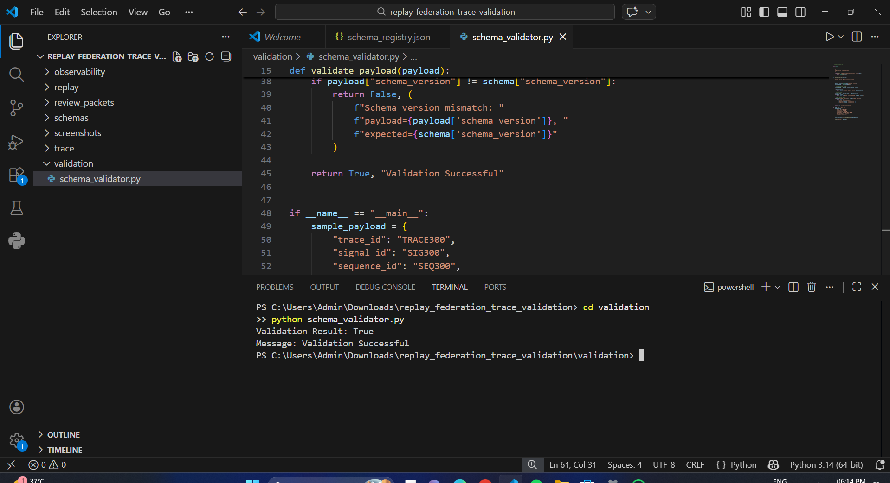

> Proves canonical schema enforcement, field rejection, and version compatibility check.

---

### 2. Replay Validation Output

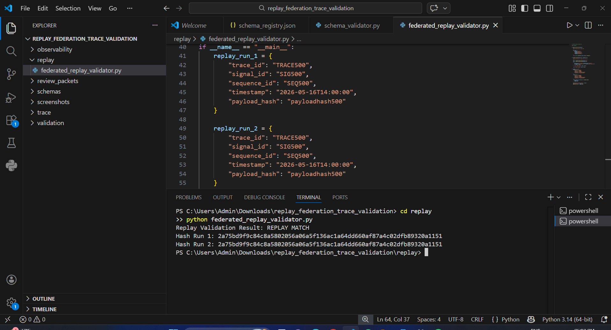

> Proves `REPLAY MATCH` across Run 1 and Run 2 with identical hash values.

---

### 3. Multi Replay Hash Verification

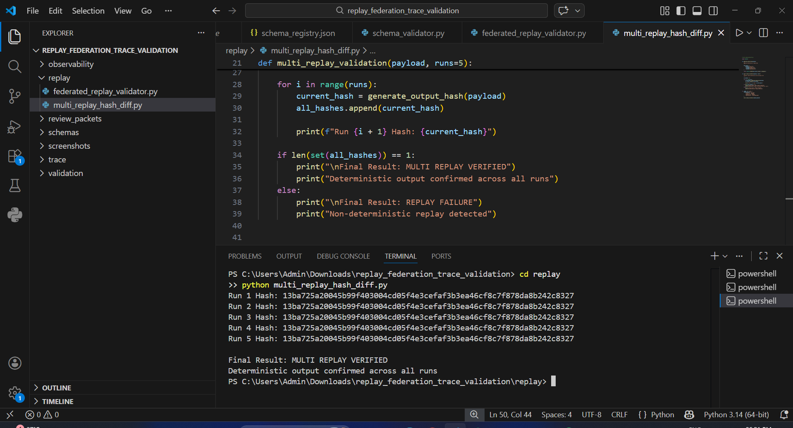

> Proves all 5 replay runs produce identical hashes — deterministic output confirmed.

---

### 4. Corrupted Replay Failure

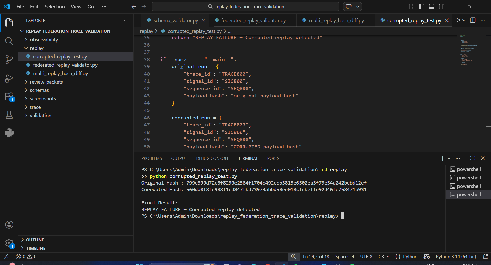

> Proves `REPLAY FAILURE` is triggered when payload is tampered. Hash mismatch is visible.

---

### 5. Duplicate Packet Detection

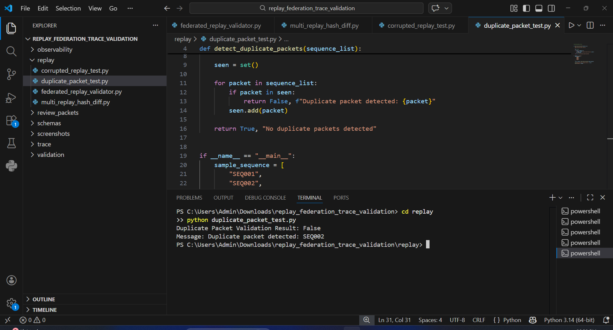

> Proves `DUPLICATE DETECTED` when injected sequence contains repeated packet IDs.

---

### 6. Trace Lineage Hash Output

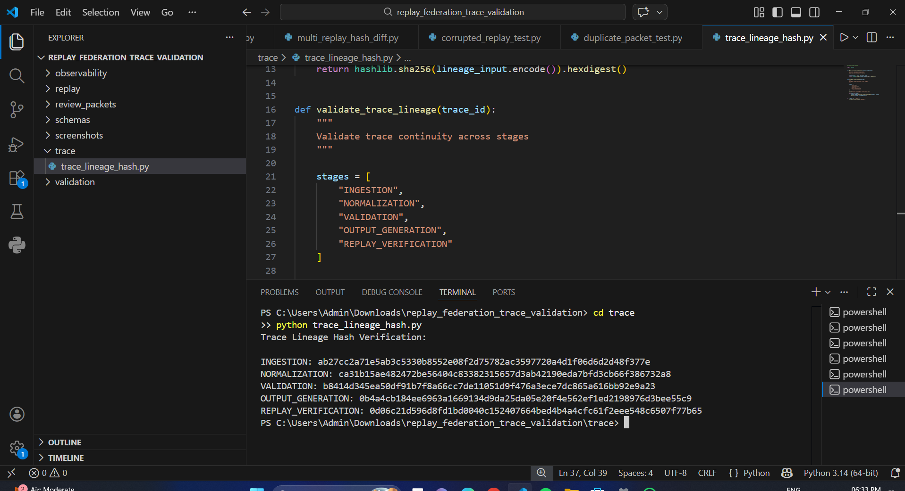

> Proves each pipeline stage generates an immutable SHA256 lineage hash for the trace.

---

### 7. Trace Continuity Output

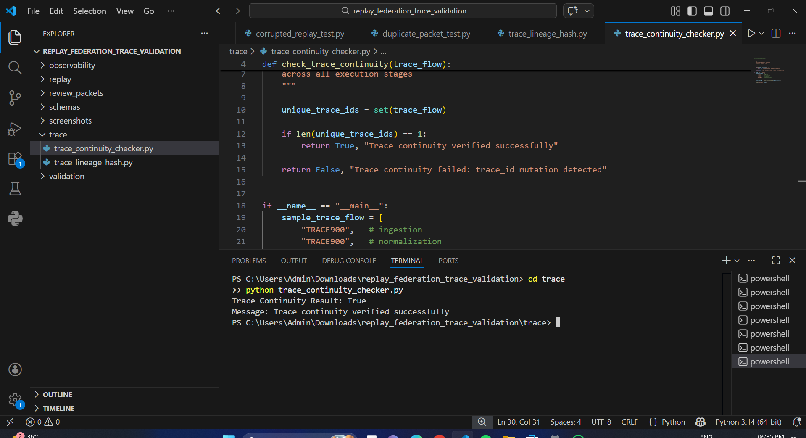

> Proves `trace_id` survives unchanged across ingestion → normalization → validation → output → replay.

---

### 8. Schema Federation Compatibility

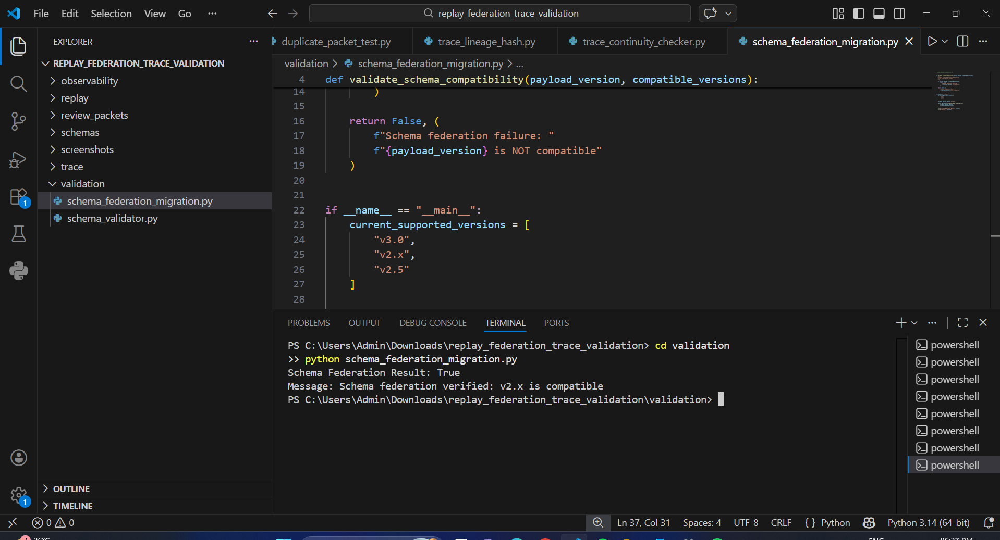

> Proves mixed-version schema federation is supported and incompatible versions are rejected.

---

### 9. Cross-System Contract Validation

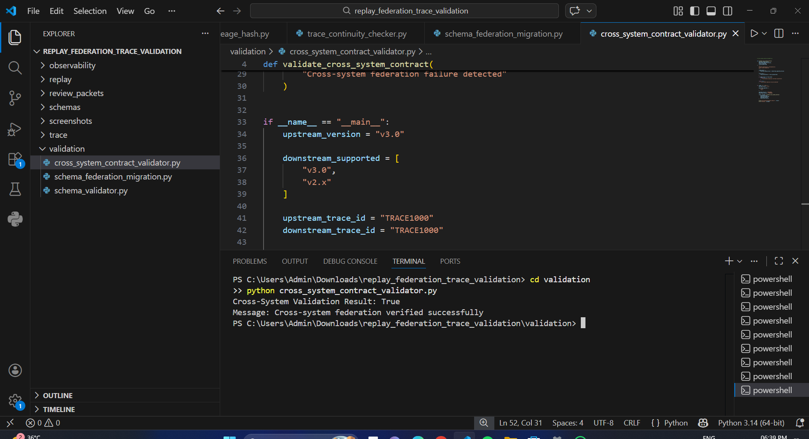

> Proves upstream and downstream systems share identical `trace_id`, schema version, and replay guarantees.

---

### 10. Rollback State Validation

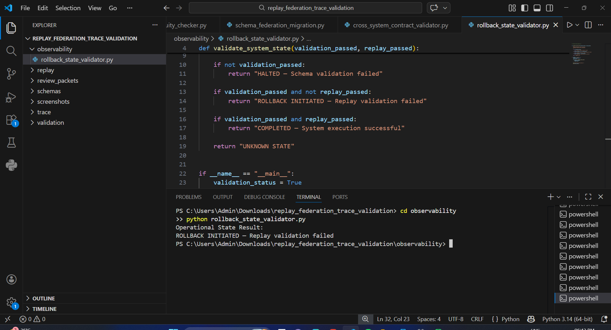

> Proves system correctly identifies `ROLLBACK INITIATED` or `COMPLETED` based on execution state.

---

### 11. Final Observability Report

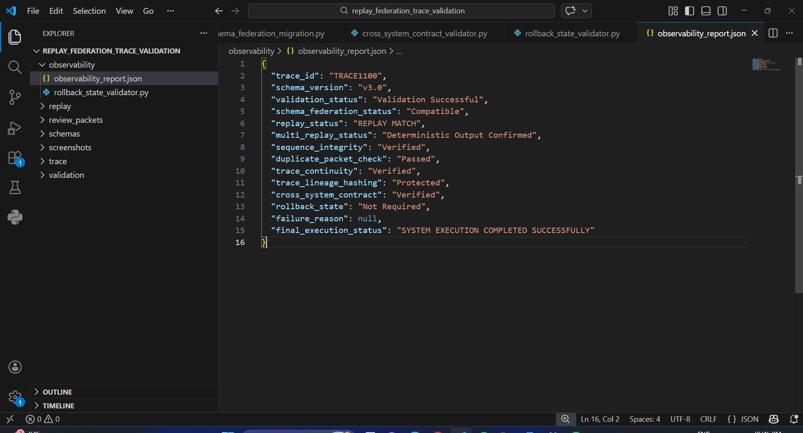

> Proves structured JSON report captures all statuses: validation, replay, trace, federation, and rollback.

---

## Final Reviewer Note

This project intentionally focuses on:

```
proof of determinism
```

**NOT**

```
description of determinism
```

because deterministic infrastructure must survive:

```
hostile execution
```

— not just ideal execution.

This is **infrastructure convergence engineering**.