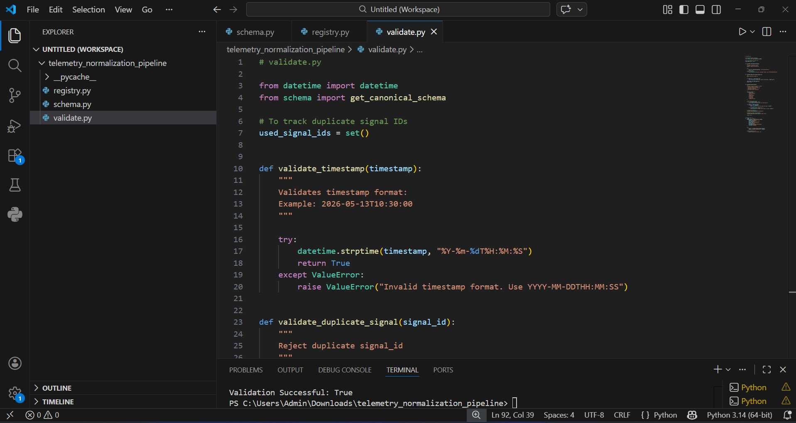
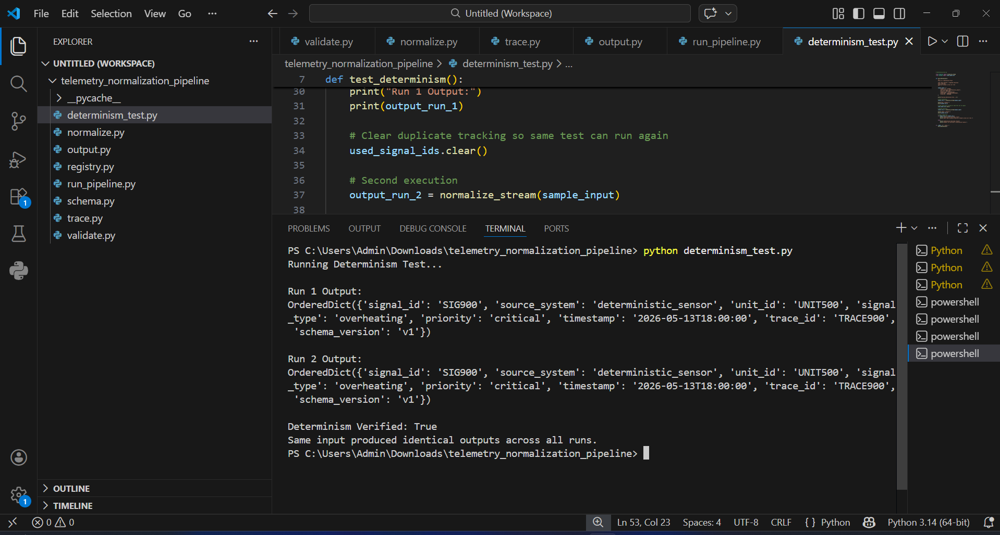
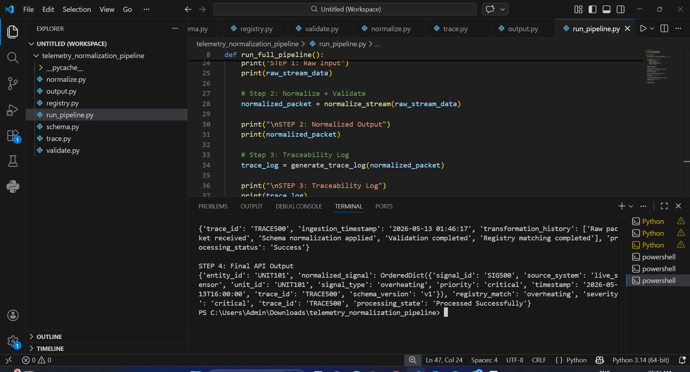
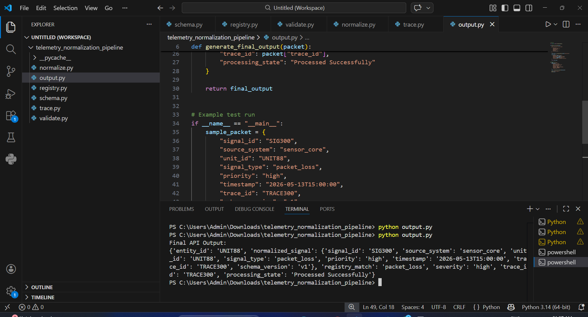

# REVIEW_PACKET.md

# Review Packet — Telemetry Normalization Pipeline

---

## Project Summary

This project builds a deterministic telemetry processing and monitoring infrastructure that validates, normalizes, and tracks telemetry signals into a clean, machine-readable, traceable, and integration-safe canonical structure.

The system includes:

* schema validation
* normalization engine
* signal registry
* traceability logging
* deterministic verification
* API-ready output generation
* failure handling proof

---

# Architecture Diagram

```text
Raw Input
   ↓
Validation Layer
   ↓
Normalization Engine
   ↓
Registry Matching
   ↓
Traceability Logging
   ↓
Final API Output
```

---

# Execution Instructions

## Run all files

```bash
python schema.py
python registry.py
python validate.py
python normalize.py
python trace.py
python output.py
python run_pipeline.py
python determinism_test.py
python logger.py
```

## Full project execution

```bash
python run_pipeline.py
```

---

# Before vs After Normalization Proof

## Before (Raw Input)

```json
{
"id": "S101",
"type": "overheating",
"time": "2026-05-13T10:00:00"
}
```

## After (Normalized Output)

```json
{
"signal_id": "S101",
"source_system": "sensor_unit",
"unit_id": "UNIT12",
"signal_type": "overheating",
"priority": "critical",
"timestamp": "2026-05-13T10:00:00",
"trace_id": "TRACE001",
"schema_version": "v1"
}
```

This proves normalization from inconsistent raw data into deterministic canonical schema.

---

# Determinism Proof Logs

Command:

```bash
python determinism_test.py
```

Expected proof:

```text
Determinism Verified: True
Same input produced identical outputs across all runs.
```

---

# Validation Logs

Command:

```bash
python validate.py
```

Expected output:

```text
Validation Successful: True
```

Validation includes:

* duplicate signal rejection
* malformed packet rejection
* timestamp validation
* invalid schema rejection

---

# Failure Handling Proof

System correctly handles:

* corrupted payloads
* missing timestamps
* unsupported signal types
* empty packets

Examples:

```text
Unsupported signal type → Rejected
Missing timestamp → Validation Failed
Empty packet → Missing required field
```

---

# Final API Output Proof

Command:

```bash
python output.py
```

This confirms:

* normalized signal generation
* registry matching
* severity assignment
* trace preservation
* final API contract completion

---

# Demo Screenshots

## Validation Output



## Determinism Test



## Full Pipeline Execution



## Final API Output



---

# Deliverables Included

* Updated GitHub Repository
* REVIEW_PACKET.md
* Registry Schema File
* Normalization Engine
* Validation Logs
* Determinism Proof
* Failure Handling Proof
* Demo Screenshots
* Architecture Documentation

---
